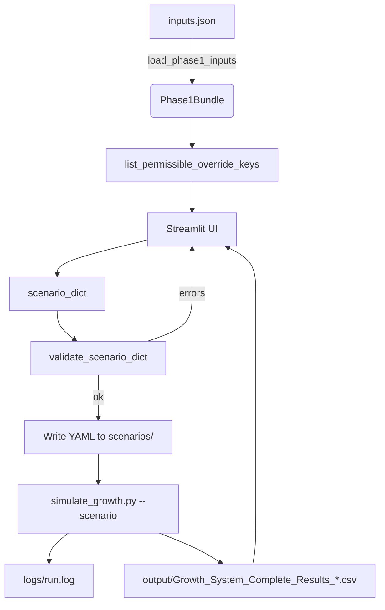

## Growth System – Scenario Input GUI (UX) Implementation Plan

### 1) Objective
Create a simple, robust GUI that lets non-technical users compose scenario files (YAML) for the existing Growth System without changing the core model or runner. The GUI focuses on: selecting a time horizon, editing parameter overrides (constants, time-series), primary map replacements, and seeding, with built-in validation and the ability to run and preview results.

### 2) Scope and Non‑Goals
- In-scope:
  - Build a Streamlit GUI that reads `inputs.json`, exposes editable scenario fields, validates, saves to `scenarios/`, and can invoke the runner to produce outputs and preview KPIs.
  - Minimal, non-breaking additions to `src/scenario_loader.py` to expose public helper APIs.
  - Sector-mode and SM-mode are both included in v1 (full edit/validate/run support).
- Non-goals (for v1):
  - Editing the base `inputs.json` through the GUI (we focus on scenario overrides, not base data maintenance).
  - Multi-scenario batch running or cloud deployment.
  - Changing model logic, element naming, or runner behavior.

### 3) User Personas and Core Flows
- Business stakeholder: defines horizon and key parameter changes; expects validation help, explanations, and a preview of outputs.
- Analyst/PM: curates presets, compares scenarios, tweaks time-series.

Core flows:
1) Load `inputs.json` → show lists, defaults, and permissible override keys.
2) User edits runspecs, constants, time series, primary map, and seeds.
3) Validate → correct issues (inline hints) → Save YAML in `scenarios/`.
4) Optional: Run now → stream logs → preview KPI CSV.

### 4) Architecture
- Keep core isolated. New code lives under `ui/` (Streamlit app). The app imports public helpers from `src/`.
- Add minimal public helpers in `src/scenario_loader.py` to surface permissible keys and to validate a scenario dict in-memory.

### 5) Modules and APIs

#### 5.1 New public helpers (minimal, non-breaking)
- File: `src/scenario_loader.py`
  - `def list_permissible_override_keys(bundle: Phase1Bundle, *, anchor_mode: str = "sector", extra_sm_pairs: list[tuple[str, str]] | None = None) -> dict:`
    - Returns: `{ "constants": set[str], "points": set[str] }`
    - Thin wrapper around existing `_collect_permissible_override_keys` with a clean dict return.
  - `def validate_scenario_dict(bundle: Phase1Bundle, scenario_dict: dict) -> object:`
    - Validates and returns the structured `Scenario` object (same type produced by `load_and_validate_scenario`), or raises `ValueError` with actionable messages.
  - Optional (quality-of-life):
    - `def summarize_lists(bundle: Phase1Bundle) -> dict:` with keys like `markets`, `sectors`, `materials`, `sector_to_materials` for UI dropdowns/context.

Note: These helpers do not change behavior; they surface existing logic to the UI.

#### 5.2 Streamlit app structure
- Directory: `ui/`
  - `app.py`: entry; layout, routing (tabs/pages), global load of `Phase1Bundle`.
  - `state.py`: typed dataclasses for UI state (runspecs, constants, points, primary_map, seeds) and (de)serialization helpers.
  - `services/builder.py`: assemble scenario dict from UI state; YAML read/write; import/export.
  - `services/validation_client.py`: calls `validate_scenario_dict` and formats error messages for UI.
  - `services/runner.py`: runs `simulate_growth.py` in a subprocess; streams `logs/run.log`; returns output CSV path.
  - `components/` (UI widgets):
    - `runspecs_form.py`
    - `constants_editor.py` (sector, material, SM tabs)
    - `points_editor.py` (price and capacity per material; sortable grid)
    - `primary_map_editor.py`
    - `seeds_editor.py`
    - `preview_panel.py` (KPI CSV preview & download)

### 6) UX Outline
- Header: scenario name, preset selector, mode switch (`sector` / `sm`).
- Tab: Runspecs (starttime, stoptime, dt, anchor_mode). Inline docstrings.
- Tab: Constants
  - Sub-tab: Per-Sector (Anchor)
  - Sub-tab: Per-Material (Other clients)
  - Sub-tab: Per-(Sector,Material) for SM-mode (visible only when `anchor_mode == sm`).
  - Only show permissible keys; display base values from `inputs.json` for context; user toggles an override (checkbox) to edit.
- Tab: Time Series (Points)
  - For each material: editable table for `price_<m>` and `max_capacity_<m>` with add/remove rows; enforce sorted years; numeric coercion; inline warnings.
- Tab: Primary Map
  - Sector dropdown → assign materials and `StartYear`; show current vs proposed mapping side-by-side.
- Tab: Seeding
  - Anchor per sector (+ optional `elapsed_quarters`), direct per material, SM seeds per pair.
- Footer: Validate → Save YAML → optional Run & Preview.

### 7) Data and Validation Rules (enforced by UI + helpers)
- Use `list_permissible_override_keys` for element-name correctness; no manual typing.
- Ensure points are strictly increasing by Year; coerce numerics; show inline hints.
- Primary map edits limited to existing sectors/materials; require numeric `start_year`.
- Seeds must be non-negative integers with valid sectors/materials; SM seeds require SM pairs known to the model.
- On Validate, call `validate_scenario_dict`; show all errors together with clear anchors to fields.

### 8) Runner Integration
- Command: `python simulate_growth.py --scenario <path> [--kpi-sm-revenue-rows] [--kpi-sm-client-rows] [--debug]`
- Stream logs from `logs/run.log` into a collapsible console area; tail while process is running.
- On completion, detect the latest `output/Growth_System_Complete_Results_*.csv`, preview as table and allow download.

### 9) Dependencies and Environment
- Add `streamlit>=1.32` to root `requirements.txt` (or create `ui/requirements.txt` if you prefer isolation).
- Optional: `pandas` (already present), `PyYAML` (already present), `watchdog` for responsive log tailing.
- Local venv recommended; Dockerization as an option later.

### 10) Work Packages (WPs) and Estimates
- WP1 (0.5d): Add public helpers in `src/scenario_loader.py`, plus tiny docstrings. Unit tests for these helpers.
- WP2 (0.5d): Streamlit project bootstrap (`ui/`), shared state model, load `Phase1Bundle`, permissible keys plumbed.
- WP3 (1d): Runspecs and Constants editors (sector/material; SM tab scaffolded behind flag).
- WP4 (1d): Points editor with sortable/year-validated tables; import/export of per-material series.
- WP5 (0.5d): Primary map editor with diff view; validations.
- WP6 (0.5d): Seeds editor (sector, material, SM-mode optional).
- WP7 (0.5d): Validation + YAML writer; error formatting.
- WP8 (0.5d): Runner integration, log streaming, KPI preview.
- WP9 (0.5d): Polish, tooltips, presets loader, simple theming, docs.

Note: SM-mode effort is accounted for in phase estimates; additional time may be needed if `lists_sm`/`anchor_params_sm` coverage is incomplete in `inputs.json`.

### 11) Testing Strategy
- Unit: helpers (`list_permissible_override_keys`, `validate_scenario_dict`, `summarize_lists`).
- Integration: build a minimal scenario in-memory and validate (no file IO).
- E2E (local): GUI-driven save → run → CSV preview smoke test using a small horizon (e.g., 2–4 quarters) preset.
- Regression: ensure validations match existing CLI behavior on invalid scenarios.

### 12) Risks and Mitigations
- Drift in naming rules or new parameters: mitigate by deriving permissible keys at runtime from the bundle and naming helpers; avoid hardcoding.
- Long-running simulations blocking UI: run in subprocess; stream logs; provide cancel button.
- Time-series editing errors: enforce sorting and numeric coercion; live validation.
- SM-mode complexity: enforce `lists_sm`/SM-coverage via validations; provide clear guidance if coverage is incomplete.

### 13) Acceptance Criteria (v1)
- Can load `inputs.json` and display sectors/materials and permissible override keys.
- User can compose runspecs + overrides (constants and points), primary map, and seeds.
- “Validate” reports clear, actionable errors using the exact backend checks.
- “Save” writes a valid YAML to `scenarios/`; “Run” executes and surfaces logs.
- KPI CSV preview is visible in the GUI after a successful run.
- No changes to model/runner behavior beyond adding helper APIs.

### 14) Open Questions
1) Confirm Streamlit as the GUI framework (browser-based) vs. a native desktop alternative.
2) Do you want the GUI to manage scenario presets (list, duplicate, delete) in `scenarios/`?
3) Is Docker packaging desired now, or is local venv sufficient for your workflow?
4) Any security constraints (e.g., restricting file save locations) we should respect?

### 15) Next Step Options
1) Approve this plan and greenlight WP1–WP3 (helpers + skeleton + runspecs/constants editors).
2) Request inclusion of full SM-mode in v1, expanding WP3/WP6.
3) Ask for Docker packaging in parallel (compose file + dev container).
4) Add a minimal “Scenario Compare” page that loads two saved scenarios and highlights diff (v1.1).
5) Provide the 1–2 top scenarios you want templated first (we’ll pre-load them as presets).

### 16) Phased Roadmap (Step-by-Step)

Each phase has clear goals, tasks, deliverables, and exit criteria. Phases are ordered to de-risk early and build vertically. Items marked optional can be deferred to v1.1.

- Phase 0 — Baseline Verification and Env Setup (0.25d)
  - Tasks:
    - Confirm `python simulate_growth.py --preset baseline` runs and produces CSV.
    - Ensure logs and outputs are written to expected folders.
    - Create/activate venv; pin dependencies; verify `streamlit` availability decision.
  - Deliverables: Run log, output CSV, verified environment.
  - Exit criteria: Runner works locally with baseline; venv documented.

- Phase 1 — Public Helper APIs in Loader (0.5d)
  - Tasks:
    - Implement `list_permissible_override_keys`, `validate_scenario_dict`, and `summarize_lists` in `src/scenario_loader.py`.
    - Unit tests for these helpers.
  - Deliverables: Helpers with docstrings; passing tests.
  - Exit criteria: UI can programmatically get valid keys and validate in-memory scenarios.

- Phase 2 — UI Bootstrap and State Model (0.5d)
  - Tasks:
    - Create `ui/` structure and `app.py` skeleton with tabs.
    - Implement `state.py` dataclasses for runspecs, constants, points, primary_map, seeds.
    - Load `Phase1Bundle` once; cache lists and permissible keys.
  - Deliverables: Running Streamlit app with empty forms and loaded context.
  - Exit criteria: App starts; shows lists/selections sourced from bundle; no editing yet.

- Phase 3 — Runspecs Form (0.25d)
  - Tasks:
    - Add form for `starttime`, `stoptime`, `dt`, `anchor_mode`.
    - Inline validation: numeric ranges; start < stop; dt > 0; allowed modes.
  - Deliverables: Runspecs tab with live validation and persisted state.
  - Exit criteria: Runspecs saved in UI state without errors.

- Phase 4 — Constants Editor (Sector/Material) (0.75d)
  - Tasks:
    - Build per-sector (Anchor) and per-material (Other) editors.
    - Show base values from `inputs.json` for context; overrides are opt-in (toggle → input).
    - Constrain inputs to permissible keys; numeric coercion.
  - Deliverables: Constants tab with two sub-tabs; overrides captured in state.
  - Exit criteria: Produces a valid `overrides.constants` dict (structure-only, not yet validated end-to-end).

- Phase 5 — Time-Series (Points) Editor (1d)
  - Tasks:
    - Per-material tables for `price_<m>` and `max_capacity_<m>`.
    - Add/remove rows; enforce strict increasing Year; numeric coercion; sorting.
    - Optional CSV import/export for a single material (v1.1).
  - Deliverables: Points tab with validated tables and state persistence.
  - Exit criteria: Produces a valid `overrides.points` structure (pre-validation).

- Phase 6 — Primary Map Editor (0.5d)
  - Tasks:
    - Sector picker → materials multi-select with `StartYear` per pair.
    - Visual diff of current vs proposed mapping.
  - Deliverables: Primary Map tab with atomic replace per sector.
  - Exit criteria: Valid `overrides.primary_map` structure in state.

- Phase 7 — Seeds Editor (0.5d)
  - Tasks:
    - Anchor seeds per sector (+ optional `elapsed_quarters`).
    - Direct seeds per material.
    - SM seeds per (sector, material) when `anchor_mode == sm` (required in v1).
  - Deliverables: Seeds tab with integer-only constraints.
  - Exit criteria: Seeds structures present and internally consistent.

- Phase 8 — Scenario Assembly + Validation + YAML Writer (0.5d)
  - Tasks:
    - Convert UI state → scenario dict; minimal, clean schema.
    - Call `validate_scenario_dict` and surface errors inline with field anchors.
    - On success, write YAML to `scenarios/<name>.yaml` (safe overwrite prompt).
  - Deliverables: Validate and Save buttons; helpful error rendering.
  - Exit criteria: Valid YAML written; re-loadable by CLI runner.

- Phase 9 — Runner Integration + Log Streaming + KPI Preview (0.5d)
  - Tasks:
    - Spawn `simulate_growth.py --scenario <path>` via subprocess.
    - Tail `logs/run.log` into a console panel; show progress and completion status.
    - On success, detect output CSV and render preview; allow download.
  - Deliverables: Run/Cancel controls; live logs; KPI table preview.
  - Exit criteria: End-to-end from GUI edit → run → preview works.

- Phase 10 — SM-Mode Enhancements (required, 0.5–1d)
  - Tasks:
    - Enable SM constants editor for per-(sector, material) parameters using permissible keys.
    - Enforce `lists_sm` coverage where required; precise error messages.
    - SM seeds editor visibility and validation.
  - Deliverables: SM mode parity where inputs allow.
  - Exit criteria: SM scenarios validate and run via GUI when base inputs support them (this is mandatory for v1).

- Phase 11 — Polish, Presets, and Docs (0.5d)
  - Tasks:
    - Tooltips with business-language descriptions; light theming.
    - Preset selector to load existing scenarios for editing; duplicate/save-as.
    - Update `index.md` with GUI usage; add screenshots (optional).
  - Deliverables: UX refinements; preset management; documentation.
  - Exit criteria: Usability approved; docs merged.

- Phase 12 — Packaging (0.5d)
  - Tasks:
    - Confirm venv instructions; add a `make` target or script to run the app.
    - Optional: Dockerfile and compose for the GUI with mounted volumes (`scenarios/`, `logs/`, `output/`).
  - Deliverables: Launch instructions and container option (if chosen).
  - Exit criteria: One-command local start; optional Docker start verified.

- Phase 13 — Hardening & Regression (0.5d)
  - Tasks:
    - Add integration tests for helper functions and scenario round-trips.
    - Validate equality of CLI vs GUI-generated scenarios for a few presets.
    - Capture common error cases (naming, sorting, missing coverage) in tests.
  - Deliverables: Test cases; CI green (if applicable).
  - Exit criteria: Stable behavior across updates; reduced regression risk.